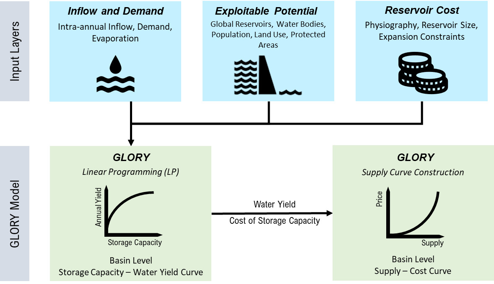

User Guide
===============

This page gives details on model settings.

Workflow Overview
-----------------

The core workflow of ``GLORY`` consists of 2 stages: linear programming and supply curve construction.

|

Global River Basins
-------------------

The default ``GLORY`` model is operating for each of the 235 global river basins shown in the figure. Details on basin names and the corresponding basin ID can be found using ``GLORY`` functions.

.. code-block:: python

    import glory

    config = glory.ConfigReader(config_file='path/to/config/file')

    # use any basin_id and period
    data = glory.DataLoader(config=config,
                            basin_id=83,
                            period=2025)

    # check the global basins
    data.basin_name_std

.. figure:: _static/gcam_basin_robinson_projection.png
  :width: 90%
  :alt: basins
  :align: center
  :figclass: align-center

Input Data
------------------------

The input data are pre-processed data for GLORY based on various dataset including hydrology , water demand, GranD, hydroLAKES, land use land cover, population, protected areas, and slope. The followings describes the structure of the input data.

.. note::
    To update the data, please follow the same data format and structure for each input file.

Climate Data
^^^^^^^^^^^^

 =================== ======================================================================================= ==========
  Variable Name       Description                                                                             Unit
 =================== ======================================================================================= ==========
  basin_id            Basin ID                                                                                \-
  basin_name          Basin name                                                                              \-
  period              Period for a range of years. E.g., period 2025 is a 5-year period of 2021-2025          \-
  runoff_km3          Average annual basin runoff over the period                                             km\ :sup:`3`/year
  evaporation_km      Average annual evaporation depth from reservoir surface over the period for the basin   km/year
 =================== ======================================================================================= ==========

Water Demand Data
^^^^^^^^^^^^^^^^^

 =============== =========================================================================================== ==========
  Variable Name   Description                                                                                 Unit
 =============== =========================================================================================== ==========
  basin_id        Basin ID                                                                                    \-
  basin_name      Basin Name                                                                                  \-
  sector          Demand sectors, including domestic, electric, industry, irrigation, livestock, and mining   \-
  demand_km3      The historical average annual water demand from the sector                                  km\ :sup:`3`/year
 =============== =========================================================================================== ==========

Profile Data
^^^^^^^^^^^^

 =============== ============================================================================================================== ======
  Variable Name   Description                                                                                                    Unit
 =============== ============================================================================================================== ======
  basin_id        Basin ID                                                                                                       \-
  basin_name      Basin Name                                                                                                     \-
  period          Period for a range of years. E.g., period 2025 is a 5-year period of 2021-2025                                 \-
  month           Month number. E.g., 1, 2, ..., 12                                                                              \-
  inflow          Monthly profile of average inflow over the period to the reservoirs within the basin                           \-
  evaporation     Monthly profile of average evaporation over the period from water surface to the reservoirs within the basin   \-
  domestic        Monthly profile of average domestic water demand over the period within the basin                              \-
  electric        Monthly profile of average electricity water demand over the period within the basin                           \-
  industry        Monthly profile of average industrial water demand over the period within the basin                            \-
  irrigation      Monthly profile of average irrigation water demand over the period within the basin                            \-
  livestock       Monthly profile of average livestock water demand over the period within the basin                             \-
  mining          Monthly profile of average mining water demand over the period within the basin                                \-
 =============== ============================================================================================================== ======

Basin Slope
^^^^^^^^^^^

 =============== ===================== ======
  Variable Name   Description           Unit
 =============== ===================== ======
  basin_id        Basin ID              \-
  basin_name      Basin name            \-
  slope           Average basin slope   \-
 =============== ===================== ======

Reservoir Data
^^^^^^^^^^^^^^

 =================== ========================================================================= ======
  Variable Name       Description                                                               Unit
 =================== ========================================================================= ======
  basin_id            Basin ID                                                                  \-
  basin_name          Basin name                                                                \-
  mean_cap_km3        Average basin reservoir storage capacity                                  km\ :sup:`3`
  nonhydro_cap_km3    Total storage capacity for non hydropower reservoirs                      km\ :sup:`3`
  nonhydro_area_km2   Total surface area for non hydropower reservoirs                          km\ :sup:`2`
  expan_cap_km3       Expandable/exploitable basin storage capacity potential                   km\ :sup:`3`
  b                   Parameter b in the area-volume relationship V=cA^b for basin reservoirs   \-
  c                   Parameter c in the area-volume relationship V=cA^b for basin reservoirs   \-
 =================== ========================================================================= ======

