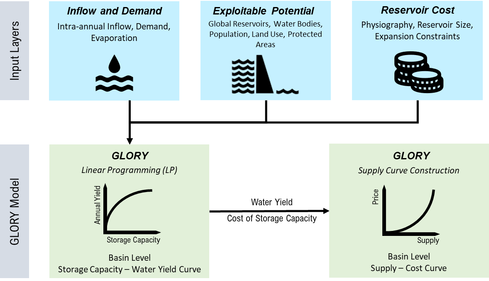
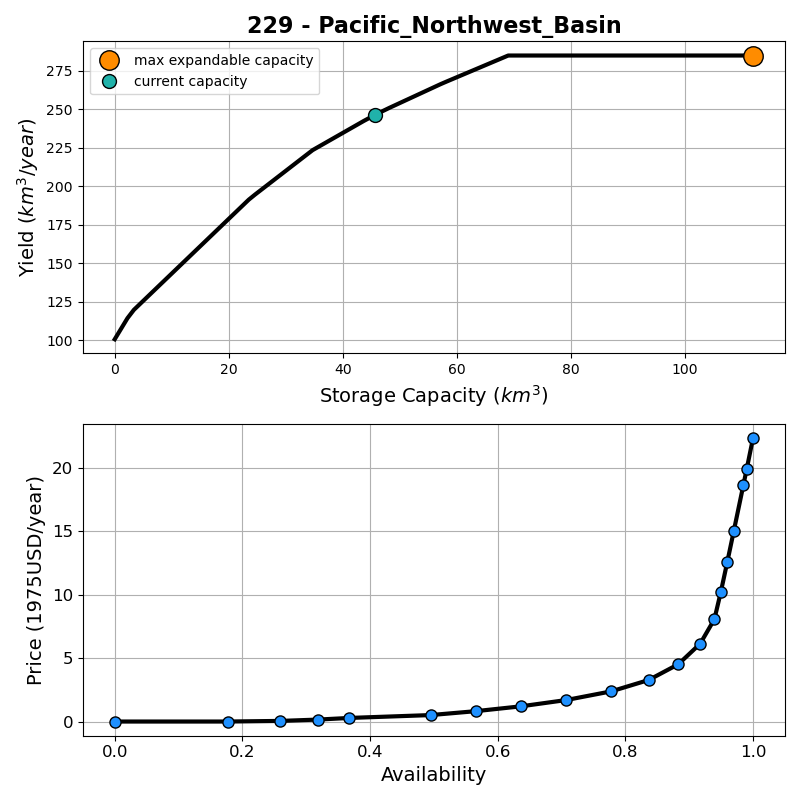

# Summary
The `GLORY` (GLObal Reservoir Yield) model is an open-source Python package designed to estimate the economic costs associated with supplying 
increasing levels of water yield from reservoir storage across the world's large river basins (Figure 1). For each river basin, the model first uses linear
programming to optimize a reservoir release strategy designed to maximize the annual basin-wide volumetric yield of water that can be achieved
for increasing levels of reservoir storage capacity, subject to geophysical constraints. For example, the model conducts a monthly time-step reservoir water 
balance that accounts for the sub-annual timing of streamflow (i.e., reservoir inflows), surface water evaporation, reservoir release, environmental flows, return flows, 
and spills. Other constraints include the sub-annual timing of water demands, and the suitability of riverine corridors for reservoir construction. 
The result of the optimization is a single capacity-yield curve for each of 235 global river basins that describes the annual volumetric water yield that can be obtained through incremental 
increases in a basin's total reservoir storage capacity. The model's focus on maximizing yield makes it more amenable to the study of irrigation and water supply reservoir potential. 
Next, the model converts each capacity-yield curve into a supply cost curve by converting each level of reservoir storage volume on the curve into a levelized cost, taking into account physiographically specific reservoir construction costs and other specifications (e.g., average reservoir size).
On their own, capacity-yield and cost curves are useful for various analyses of water resources systems (https://iopscience.iop.org/article/10.1088/1748-9326/aab2b5/meta), 
including continental to global scale economic analyses of reservoir storage expansion. Additionally, GLORY's cost curves are are designed to be used in hydro-economic or 
coupled human-Earth systems assessments that require as input an economic valuation of the cost of water supply to explore multi-sector dynamic ([@Reed_2022]) interactions. 
For example, `GLORY` can be used to produce surface water cost curve inputs (https://gmd.copernicus.org/preprints/gmd-2023-204/) for the Global Change Analysis Model (GCAM), 
which can in turn be used to explore the future co-evolution of energy, water, and land systems under global change (CALVIN ET AL).

<!--Comments-->
<!-- I liked this text but have not integrated it yet. The model streamlines workflows by integrating information on climate, hydrology, water demand, reservoir exploitable potential, and physiography to estimate the water availability and prices of water supply from reservoirs.  -->

# Statement of Need
Extensive research literature is devoted to advancing methods for modeling the physical (as opposed to economic) characteristics of reservoirs, from models that operate at the scale of individual reservoirs 
or systems of reservoirs (https://doi.org/10.1016/j.envsoft.2020.104947) to global hydrology models (Abeshu et al., GMD, 2023). These efforts have focused primarily
on modeling the operations of existing reservoir fleets to meet various objectives. There is growing interest in understanding the future role reservoirs could play in meeting water demands (https://www.pnas.org/doi/abs/10.1073/pnas.2214291119), 
but there is a gap in economics-based modeling methods and software to support analyses of future expansion of dam and reservoir infrastructure ([@Vanderkelen_2021, https://gmd.copernicus.org/preprints/gmd-2023-204/)]. 
Hydro-economic and global multi-sector dynamic models (e.g., GCAM) are designed to explore (at global scale) future multi-sector water demands under global change (e.g., socioeconomic and climate change), and the competition between surface water reservoirs and other 
sources of water supply (e.g., groundwater) to meet those demands. However, these global integrated multi-sector models often require regionally differentiated cost curves that describe the cost to supply increasing quantities of surface water [CITE A GCAM WATER PAPER, BUT ALSO CAN WE CITE ANY NON-GCAM PAPERS HERE?]. 
`GLORY` fills a gap by providing these cost curves. `GLORY` was recently coupled with GCAM to create a more dynamic representation of water storage than the model's existing representation of surface water supply cost (https://link.springer.com/article/10.1007/s10584-016-1604-6).
Finally, the model produces capacity-yield curves that are also useful continental-to-global scale analyses of reservoir storage and yield potential (https://iopscience.iop.org/article/10.1088/1748-9326/aab2b5/meta). 

<!--Comments-->
<!--1. I suggest asking Hassan for a good recommendation for a citation of hydro-economic models that could use cost curves (e.g., like those superwell produces for groundwater)-->
<!--2. I added cited references that need to be added to your list if you want to keep them-->
<!--3. Please integrate these references back into the text above: [@Rising_2020; @Sen_2021]-->

# Design and Functionality
The `GLORY` model is designed to integrate complex processes of estimating reservoir water yield and cost into a pipeline. `GLORY` utilizes human-readable YAML file for easy model configuration. It can be applied to analyze either global basins or a subset of basins and periods of interest. Instead of relying on the default basin delineation, users can also switch to customized geographical boundaries, given the relevant data is available. The modular design of `GLORY` offers users the flexibility to use individual module or the entire model, depending on their interest in the water management or the economic of water supply. 

Here we briefly demonstrate how to use glory to achieve different outcomes. One can effortlessly apply the `glory::lp_model()` function to execute a linear programing model that determines the optimized water yield for a given reservoir storage capacity. To generate a capacity-yield curve and a supply curve with discrete points for a single basin (e.g., Figure 2), users can easily instantiate the `glory::SupplyCurve()` object by providing the configuration object. The `glory::SupplyCurve()` will then undertake the process of identifying reservoir storage capacity expansion pathways and calculating the optimized water yield at each storage capacity point. To apply `GLORY` to multiple basins, simply indicate the basin IDs in the configuration file and run `GLORY` model using `glory::run_model()`. Figure 2 shows an example output of capacity-yield curve and supply curve for Pacific Northwest basin. The detailed documentation on how to use `glory` can be accessed at [glory documentation](https://jgcri.github.io/glory/index.html).

<!--Comments-->
<!-- 1. I would include a couple of sentences on the cost curve part as well, as that is central to the functionality of the model (e.g., its utulity for GCAM) -->
<!-- 2. The figure caption for figure 2 is repeated from figure 1-->

# Acknowledgements
This research was supported by the U.S. Department of Energy, Office of Science, as part of research in MultiSector Dynamics, Earth and Environmental System Modeling Program.

# References
